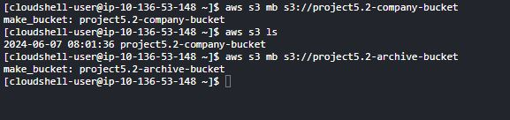
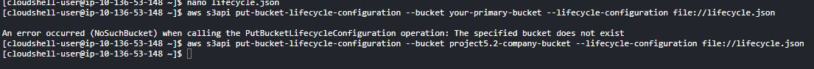
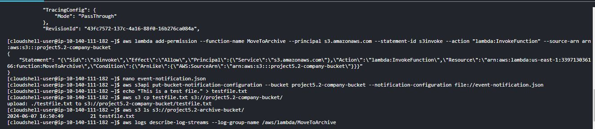
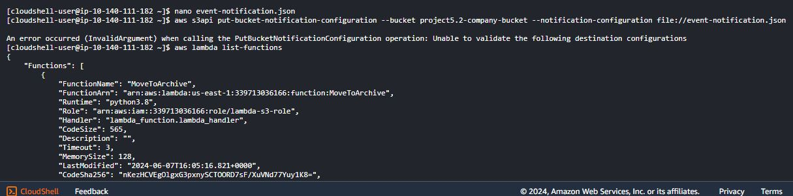
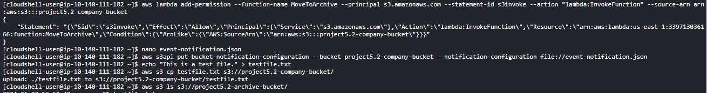

# **AWS S3 Data Archiving Strategy Project**

## **Project Goals**

- Cost Efficiency: _Minimize storage costs while maintaining data accessibility._
- Scalability: _Ensure the solution can handle dataset growth without significant cost increases._
- Quick Retrieval: _Implement strategies for fast data retrieval when needed._
- Access Control: _Manage user permissions to secure the archived data._
- Automation: _Streamline the archiving and retrieval processes._
- Documentation: _Provide clear and thorough documentation for future maintenance._

  ## **Step by Step Implementation**

  ### Step 1: Set Up Amazon S3 Buckets

  1. Create S3 Buckets:

  - Primary Bucket: Store active data
  - Archive Bucket: Store archived data
    'aws s3 mb s3://your-primary-bucket'

    'aws s3 mb s3://your-archive-bucket'
    

### Step 2: Configure Lifecycle Policies

1. Define Lifecycle Policies to transition objects from the primary bucket to the archive bucket. Created a .json file name "lifecycle.json" with codes:
   '''
   {
   "Rules": [
   {
   "ID": "Move to Glacier",
   "Status": "Enabled",
   "Prefix": "",
   "Transitions": [
   {
   "Days": 30,
   "StorageClass": "GLACIER"
   }
   ],
   "Expiration": {
   "Days": 365
   }
   }
   ]
   }
   '''
2. Apply the policy to your primary bucket,with the code:
   'aws s3api put-bucket-policy --bucket your-primary-bucket --policy file://bucket-policy.json'
   

### Step 3: Implement Access Controls

1. Set Bucket Policies and IAM Roles to manage access. created a .json file named "Access.json" write the codes:
   '''
   {
   "Version": "2012-10-17",
   "Statement": [
   {
   "Effect": "Allow",
   "Principal": {
   "AWS": "arn:aws:iam::ACCOUNT-ID:user/USERNAME"
   },
   "Action": "s3:_",
   "Resource": [
   "arn:aws:s3:::your-primary-bucket/_",
   "arn:aws:s3:::your-archive-bucket/\*"
   ]
   }
   ]
   }
   '''
2. Apply the bucket policy.

### Step 4: Automate Archiving and Retrieval

1. Automate Archiving: Use AWS Lambda to trigger the movement of data based on custom criteria, using the following steps:

- Step 1: Set Up IAM Role for Lambda
  - Create IAM Role:
  - Create a trust-policy.json file
  - Attach Policies to the Role:
- Step 2: Create Lambda Function
  - Create Lambda Deployment Package:
  - Create a lambda_function.py file
  - Create a deployment package (zip file)
    
- Step 3: Set Up S3 Event Trigger
  1.  Create Event Notification Configuration:
      - Create an event-notification.json file
  2.  Apply the Event Notification to Your S3 Bucket: Run the following command to configure your S3 bucket to trigger the Lambda function when an object is created
      
- Step 4: Test the Setup
  - Upload an Object to the Primary S3 Bucket: Create a test file and upload it to the primary S3 bucket to trigger the Lambda function:
    

2.  Automate Retrieval: Set up AWS SNS to notify when data is restored from the archive.

# **Summary**

## By completing these steps, i have been able to :

1. Granted S3 permission to invoke the Lambda function.
2. Configured the S3 bucket to trigger the Lambda function on object creation events.
3. Tested the setup to ensure it works.

## This will automate the process of moving data from the primary bucket to the archive bucket, helping me to manage data efficiently.
